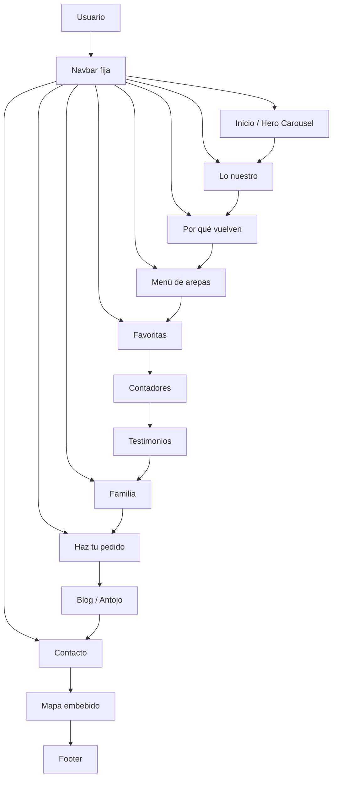
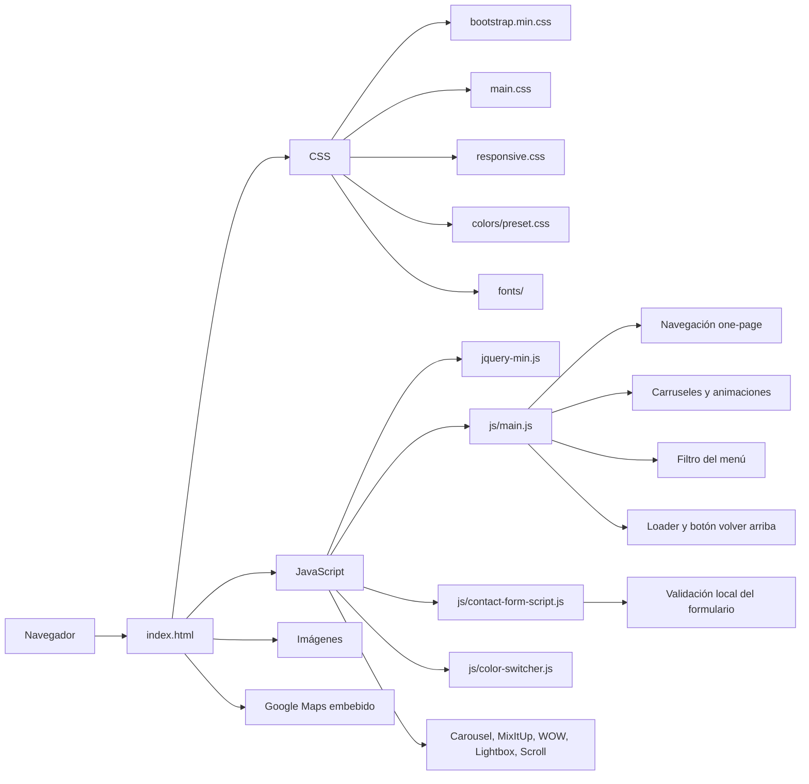
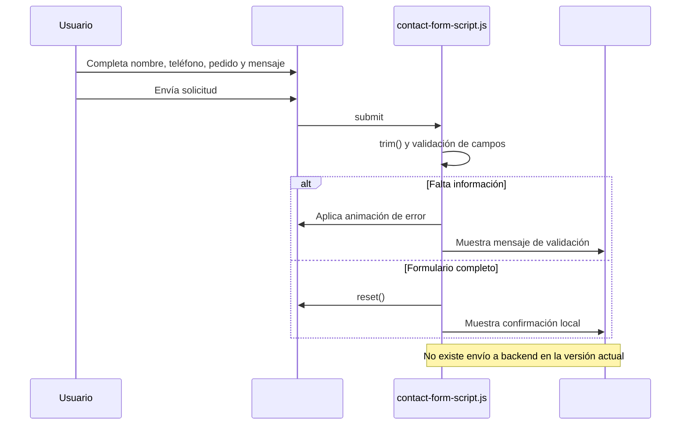
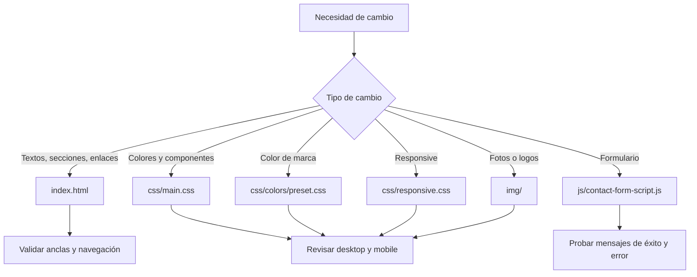

# Diagramas de documentación

Este documento resume la estructura funcional y técnica del proyecto actual.

## 1. Mapa de la página

## 2. Arquitectura de archivos y dependencias

## 3. Flujo del formulario de pedidos

## 4. Flujo de personalización de contenido

